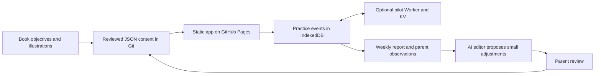

# English Trainer: book-based pilot

A small mobile web app for a Polish-speaking beginner, using soccer, Minecraft and maths as familiar contexts. A parent leads one weekly lesson and reviews adjustments; short daily practice adapts through spaced review.

**Pilot release:** [Open English Trainer](https://tjetka.github.io/private_english_tutor/). Approved by the parent on 28 September 2026; app version `2.0.0-pilot.1`, course version `2026.09-pilot.1`. The existing Cloudflare Worker now serves the pilot API, and live API/client acceptance checks passed. GitHub Pages publishes `main` from the repository root.

On the Android phone, enter a name or nickname, open **Panel rodzica**, and begin with week 1. Save **Link tego ucznia** outside the phone; use that complete link on another device. Confirm English audio and a reload during the first joint session, then download a full backup. At the end of each week, export **Pobierz raport dla agenta AI** and follow the weekly review below.

## Start here

- [Four-week pilot](docs/learning-plan.md): first three lessons from the supplied DK book, then consolidation.
- [Weekly adaptation](docs/weekly-review.md): how a parent and AI agent maintain the course with small changes.
- [Longer roadmap](docs/roadmap.md): 26 book milestones, roughly 27 weeks including the extra pilot review.
- [Implementation](docs/implementation.md): content, scheduling, growing practice history and sync.
- [Pilot deployment](docs/pilot-deployment.md): exact setup, acceptance checks and transition from v1.
- [Historical audit](docs/status.md) and [legacy deployment](docs/deployment.md): original findings and service information.

## What is prepared

The app contains 56 vocabulary items and 24 sentence patterns mapped to **My friends**, **At school**, and **Our classroom** (book pp. 10–27). Each pilot week has a parent brief, five daily prompts, a themed mission and oral checks. Material is shown before testing. Previous material returns, grammar keeps its own slots, and same-day repetitions do not increase retention levels repeatedly.

The parent panel controls week, pace and focus, records observations, and exports both a key-free review report and a full recovery backup. Progress is an append-only history in browser IndexedDB. Cloud history is enabled through the existing eng-sync Worker and its PROGRESS KV binding. The original routes remain available and pilot events use separate keys.

## Why this is maintainable

Teaching content is ordinary versioned JSON in `content/`. An agent can read a weekly report, propose a small change, validate it and show it for parent review. The app handles daily repetition. There is no runtime AI dependency, SQL administration, CMS, build pipeline or generated 26-week exercise backlog.



## Local use and checks

From the repository root:

```sh
node scripts/course.mjs validate
python3 -m pytest -q
python3 -m http.server 8000 --bind 127.0.0.1
```

Open `http://127.0.0.1:8000/` and use a synthetic profile for testing. `config.json` connects to the live Worker by default. For local-only testing, clear the sync address in **Panel rodzica** and save it; this override affects that browser origin only. Review all four weeks through the same panel.

If pytest is absent, `uv run --with pytest python -m pytest -q` creates a temporary tool environment. JavaScript tests use Node 22+ and its built-in test runner: `node --test tests/*.test.mjs`. They make no external network calls.

For a weekly report:

```sh
node scripts/course.mjs review local/english-review-YYYY-MM-DD.json
```

Keep learner exports under ignored `local/` or outside the checkout. The supplied PDF remains under ignored `book/`; its pages and recordings are not part of the deployed app. Source hash, edition and preparation provenance are recorded with the content.

Live cloud writes, reads, retries, two-client convergence, backup merge and legacy compatibility passed using synthetic profiles. Actual Android audio, browser backup import and recovery across real devices still need the first-session check. There is no guaranteed offline cold start. See [deployment and acceptance](docs/pilot-deployment.md) for the evidence and remaining checks.
