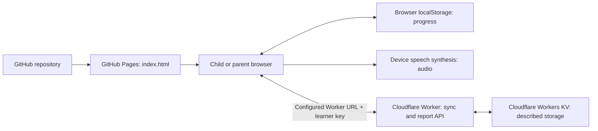

# English Trainer

A small Polish-language web app for a beginner learning English, with a football-themed interface, short exercises, speech playback and progress tracking.

**Current assessment (27 September 2026): useful practice prototype; not yet a complete personalised course.** The app contains two content units, 34 words and 11 sentences. Its simple architecture fits family use. Learning progression and cloud synchronisation need corrections before relying on them unattended.

- **Open the app:** <https://tjetka.github.io/private_english_tutor/>
- **Sync service:** <https://eng-sync.t-jetka.workers.dev>
- **Repository:** <https://github.com/TJetka/private_english_tutor>

## Start here

| Document | What it answers |
| --- | --- |
| [Status and priorities](docs/status.md) | Does the implementation meet the original aims? What matters most before regular use? |
| [Implementation](docs/implementation.md) | How are content, exercises, progress, audio and sync implemented? |
| [Deployment and recovery](docs/deployment.md) | Which services and settings are needed? How do I update, reconnect or recover the app? |
| [First week and ongoing use](docs/learning-plan.md) | How can we start on 28 September, and build a sustainable personalised learning routine? |

The review also used the locally supplied `docs/preliminary_conversation.md`, left unchanged and untracked. Treat that conversation as design background; the documents above distinguish aspirations from implemented behaviour.

## What runs where



The Worker is live, but its source and KV binding configuration are missing from this repository. KV and per-device shards are described in the background conversation; the deployed storage implementation has not been independently inspected.

There is no runtime AI integration, paid speech API, application framework, package build, login service or separate database server in the checked-in app. Content is written directly in `index.html`.

## Local preview and verification

Run from the repository root:

```sh
python3 -m http.server 8000 --bind 127.0.0.1
```

Open `http://127.0.0.1:8000/`. Use a synthetic learner for testing. Browser storage belongs to this local origin, separately from the live site. Sync is disabled initially because `SYNC_URL_DEFAULT` is empty.

The audit needs Node.js and pytest, but the app itself needs neither:

```sh
python3 -m pytest -q tests/test_current_behavior.py
python3 -m pytest -q
```

If pytest is not installed, an optional temporary environment is:

```sh
uv run --with pytest python -m pytest -q
```

Baseline: **4 passed, 9 expected failures**. Expected failures reproduce unresolved defects; this is not a clean bill of health. They are strict, so fixes require promoting the corresponding checks to ordinary passing tests. Scenarios use only synthetic data, mocked HTTP/storage, a fixed date and RNG seed 42. Run `node tests/audit_scenarios.cjs` to see observations without pytest. See [verification limits](docs/status.md#verification).
